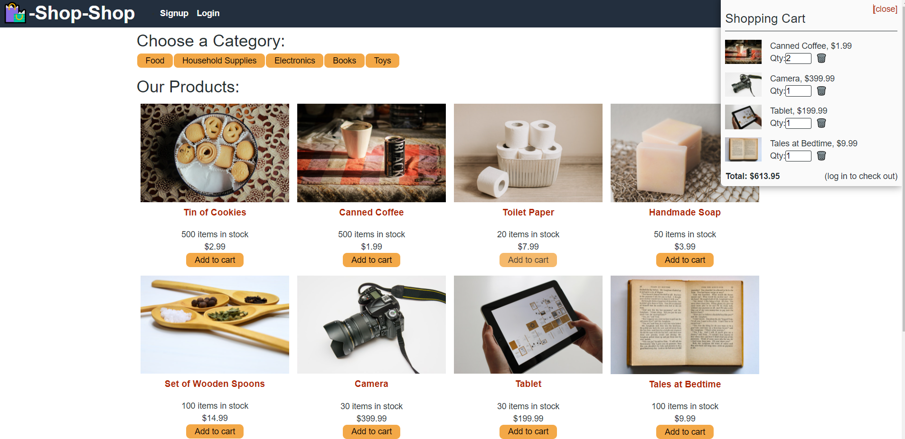

# redux-store

## Purpose
Shop-shop is an app that allows you to checkout items and buy them in the shop if you sign up. The original app used React Context for global state management, but this app was refactored to use Redux. 

## App Use
Clone repository, and then in the directory from the command line run npm install. Then use the command npm run start:dev. 

## Built With
* Javascript
* GraphQL
* Express.js
* MongoDb
* Node.js
* React.js
* Stripe
* JWT
* Apollo Server

## Live Link
https://shopshop-redux-store.herokuapp.com/

##

## Contribution
Made by Rohith Kurian. 